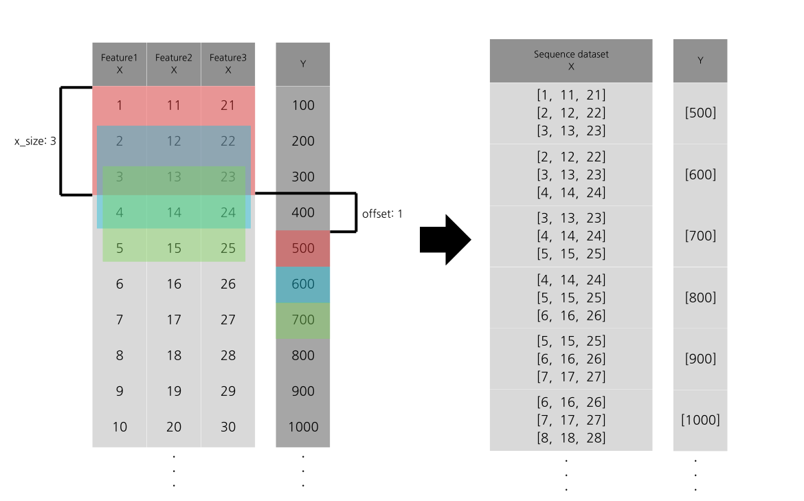
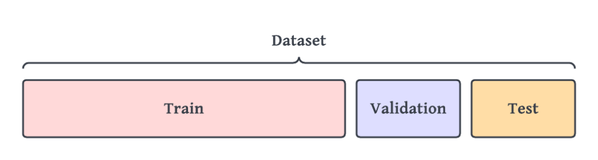
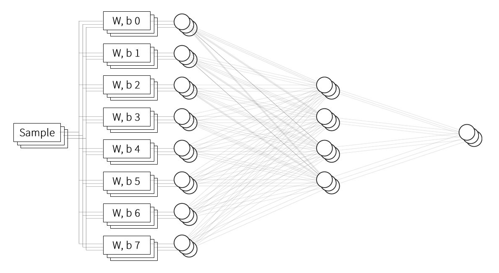

predicttool: 머신러닝 및 딥러닝 기반 암호화폐 데이터 예측 도구
===
  
# Quick start: LSTM

### 목차

- [1. Sequence Dataset 생성](#1-sequence-dataset-생성-toolspredicthelperbuild_seq_dataset)<br>
- [2. LSTM 객체 생성](#2-lstm-객체-생성-lstmbuilder)<br>
- [3. LSTM 모델 생성 및 컴파일](#3-lstm-모델-생성-및-컴파일-lstmbuildermodel_build_compile)<br>
- [4. LSTM 모델 학습](#4-lstm-모델-학습-lstmbuilderfit)<br>
- [5. LSTM 모델 평가](#5-lstm-모델-평가-lstmbuilderevaluate)<br>
- [6. 구현 참고](#구현-참고)


## 1. Sequence Dataset 생성: *tools.predicthelper.build_seq_dataset()*

```
filepath = "originaldata/example.csv"

sequence_dataset = build_seq_dataset(
    data=pd.read_csv(filepath),
    ignore_col=[6, 7],
    x_size=10,
    offset=5,
    y_mode=YMode.DIF,
    single_symbol=True,
    symbol_name="BTCUSDT"
)
```

<details>
<summary>
Sequence Dataset? 개요:
</summary>

### Sequence Dataset
Many-To-One 형태 LSTM 모델 입력으로 사용되는 데이터 구조입니다.

Features 가 3개인 2차원 데이터의 x_size=3, offset=1인 시퀀스 데이터셋을 만들 때 그림 예시: 


위 그림을 바탕으로 x_size=**3**, offset=**1** 인 시퀀스 데이터셋을 만든다는 것을 일반 문장으로 표현하면:
>**3분** 간의 *x* 데이터를 기반으로 **1분** 이후의 *y*를 예측하기 위한 데이터셋을 구성한다.

로 볼수 있습니다.

<br/>

### Output[0]- Sequence dataset X: 
Sequence dataset *x*의 Shape는 **(데이터셋 길이, x_size, Feature 개수) 형태의 3차원 numpy array**이며,   
아래와 같은 다른 형태는 모델 학습 시 사용하기 적합하지 않습니다. e.g.
- **2차원 numpy array 요소**로 이루어진 **1차원 numpy array**(내부적으로 3차원 numpy array 와 다르게 인식합니다.)
-  **pandas DataFrame** 등.  


<br/>

### Output[1]- Sequence dataset Y:
Sequence dataset *y*의 Shape는 **(데이터셋 길이, 1) 형태의 2차원 numpy array**이며, 이때 단일 값만을 예측하는 본 프로그램의 특성상 **(데이터셋 길이)** 의 **1차원 numpy array**로도 *y*의 표현이 가능하나,<br/> keras의 LSTM 모델은 Many-To-Many 모델, 즉 다수의 *x*데이터를 기반으로 다수의 *y*데이터를 예측하는 방식 또한 지원하여 이 방식과의 **입력 일관성을 위하여 2차원 numpy array로 표현**하게 됩니다.
</details>
<br/>


### build_seq_dataset의 파라미터 및 세부사항:  


|파라미터|설명|기본값|필수|
|---|---|---|---|
|data|저장된 원본 데이터 csv 파일을 pd.read_csv 함수를 통해 읽은 DataFrame|None|Y|
|ignore_col|원본 데이터로부터 무시할 특정 열 번호를 설정합니다. |None|N|
|x_size|*y* 예측을 위한 *x*의 이전 데이터 포함 크기입니다, 자세한 내용은 Sequence Dataset 개요를 참고. |5|N|
|offset|*x* 데이터 기준으로 offset 만큼 더 이후의 *y*를 예측합니다. 자세한 내용은 Sequence Dataset 개요를 참고.|5|N|
|param_index|LSTM 모델 구성과 무관한 feature를 제외한 나머지 index의 범위입니다. 일반적으로 *심볼, 날짜, 비정상성 데이터* 등이 이 파라미터로 인하여 제외됩니다.|(4, 19)|N|
|sym_n|원본 데이터의 전체 심볼 개수, 이는 [datacollection/main](../docs/datacollection.md#3-mainpy-실행)의 파라미터 "*top_volume_ticker_length*" 와 일반적으로 동일합니다.|100|N|
|single_symbol|모델이 모든 심볼 데이터에 대해서 한꺼번에 학습하는것이 아닌, 특정 단일 심볼에 대해서 시간적 흐름을 유지하는 데이터셋을 학습하기 위해 특정 심볼의 데이터로만 이루어진 데이터셋을 반환합니다.|True|N
|symbol_name|*single_symbol*이 True일 경우, 데이터셋을 구성할 특정 단일 심볼의 문자열입니다.|None|Y if single_symbol True, else N|
|y_mode|*x* 데이터로 생성된 *y* 데이터의 형식입니다. 사용 가능한 *y_mode*는 아래와 같습니다.<br> 1. *YMode.DIF* : 현재 가격을 이전 가격으로 나눈 뒤 이 변화율(***이하 가격변화율***)을 *y* 데이터로 사용합니다.<br> 2. *YMode.BIN_LIMIT* : 가격변화율을 *bin_criteria* 기준 이진 분류 데이터로 변환합니다.|YMode.DIF|N
|bin_criteria|*y_mode*가 *YMode.BIN_LIMIT* 으로 설정되었을 때, 가격변화율이 이 값 이상이면 Y = 1, 이 값 이하이면 Y = 0 입니다.|1|Y if y_mode YMode.BIN_LIMIT, else N 

<br><br><br>

## 2. LSTM 객체 생성: *LSTMBuilder*
```
model = LSTMBuilder(
    seq_dataset=sequence_dataset,
    classification=False,
    test_split=0.2,
)
```

<br><br>
#### LSTMBuilder의 파라미터 및 세부사항:  


|파라미터|설명|기본값|필수|
|---|---|---|---|
|seq_dataset|*build_seq_dataset()* 을 통해 생성된 Sequence dataset| None | Y
|classification| 이진 분류 모델 초기화 여부, **True 로 설정할 경우 이진 분류 모델**로 초기화하며, **False로 설정할 경우 회귀 모델**로 초기화합니다.|False|N|
|test_split|최종 모델 **평가** 시에 사용할 **Test** 데이터의 전체 데이터에서의 비율, 이는 학습 과정에서 **검증**에 사용되는 **Validation** 데이터와는 구분됩니다.|0.2|N|



<br><br><br>

## 3. LSTM 모델 생성 및 컴파일: *LSTMBuilder.model_build_compile()*
```
model.model_build_compile(
    lstm_unit=64,
    dense_unit=32,
    activation='relu',
    learning_rate=0.001
)
```

<br><br>

model_build_compile() 의 파라미터 및 세부사항:  


|파라미터|설명|기본값|필수|
|---|---|---|---|
|lstm_unit|LSTM 은닉층 유닛 개수| 64 | N
|dense_unit|*dense* 은닉층 유닛 개수 | 32 | N
|activation|은닉층과 출력층을 연결하는 *dense* 레이어의 활성화 함수| relu | N| 
|lerning_rate|경사하강 알고리즘에서의 가중치, = 학습률 | 0.001|N

<br>

(lstm_unit=8, dense_unit=4), batch_size=3 파라미터로 구성된 뉴럴 네트워크 다이어그램:<br/>
(여기에서 batch size 는 *x* 원본 데이터 Sample과 무관하며 학습 시 병렬 처리와 관련됩니다.)



<br><br><br>

## 4. LSTM 모델 학습: *LSTMBuilder.fit()*

```
model.fit(
    val_split=0.2,
    epochs=100,
    batch_size=64,
    early_stopping=False,
    early_stopping_patience=3,
    checkpoint=False
)
```

<br><br>

#### fit() 의 파라미터 및 세부사항:  


참고: [Keras Model Training API: fit()](https://keras.io/api/models/model_training_apis/#fit-method)

|파라미터|설명|기본값|필수|
|---|---|---|---|
|val_split|학습 과정에서 Train data를 학습한 모델의 손실 감소가 실제 데이터에서도 유의미하게 적용될 수 있는지 검증하는 목적으로 사용되는 데이터의 비율, =*validation_split*|0.2|N|
|epochs|모델 학습 반복 횟수, 입력된 전체 데이터를 학습했을 경우 반복 횟수는 '1' 증가합니다.|100|N|
|batch_size|한 번의 가중치와 편향 업데이트 과정에서 동시에 입력될 샘플 수. | 64| N|
|early_stopping|각 *epoch* 검증 데이터를 통해 모델의 성능을 평가하고, 이 성능이 더 이상 증가하지 않을 경우 학습을 종료합니다.|False|N
|early_stopping_patience|*early_stopping* 파라미터에서, 몇 번의 학습에 걸쳐서 더 이상 성능이 증가하지 않을 경우 학습을 종료할지 결정합니다. |3| Y if early_stopping True, else N|
|checkpoint|각 *epoch* 마다 검증 데이터를 통해 모델의 성능을 평가하고, 성능이 이 학습에서 가장 높다면, 해당 모델을 *checkpoint/best_lstm_model{time}.keras* 파일로 저장합니다.|False|N

<br><br><br>


## 5. LSTM 모델 평가: LSTMBuilder.evaluate()

```
model.evaluate(plot_loss_history=True)
```

<br><br>
#### evaluate() 의 파라미터 및 세부사항:  


|파라미터|설명|기본값|필수|
|---|---|---|---|
|plot_loss_history|학습 과정에서의 학습 데이터 손실률, 검증 데이터 손실률의 *epoch* 진행에 따른 변화를 그래프로 확인합니다.|True|N|


### 출력: 
[predicttool/result](../predicttool/result/) 위치에 예측 및 평가 결과 csv 파일이 생성되며 여기에는 손실률, 평가 지표와 그 수치도 같이 포함됩니다.<br/> 실제 파일 예시는 다음과 같습니다:
|y_test|y_test를 모델이 예측한 데이터|예측 모델 손실률|평가 지표 1|평가 지표 x|...|
|---|---|---|---|---|---|
|y1|y1|loss:0.027|mae:0.042|...|
|y2|y2||||
|y3|y3|
|...|...|

<br><br><br>

## 구현 참고

이 가이드 기반으로 구현된 Python 스크립트는 [predicttool/LSTMBuilder.py](../predicttool/LSTMmain.py) 에서 확인할 수 있습니다.